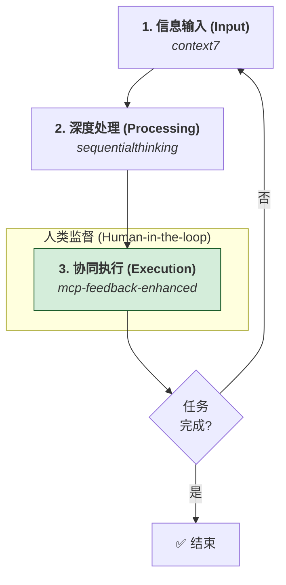

# MCP工具间通信与设计方案研讨会纪要

> 本文档总结了我们关于MCP（Model Context Protocol）工具间通信机制、架构设计、NPM包开发以及未来发展方向的深入讨论。

---

## 核心议题一：MCP工具间能否通信？

- **初步结论**：MCP工具本身是独立的，**无法直接相互调用**。
- **实现方式**：可以通过AI助手（如Cursor/Claude）作为"中介"，实现间接的通信和数据流转。

---

## 核心议题二：如何设计一个MCP通信系统？

> 这是一个贯穿我们整个讨论的核心。我们设计了一个**基于共享状态的异步消息传递系统**，它以NPM包的形式提供给各个MCP工具使用。

### 架构设计

- **去中心化**：无中央服务器，所有工具平等地读写共享状态。
- **松耦合**：工具间通过发布/订阅消息进行异步通信，不直接依赖。
- **持久化**：消息存储在本地文件系统（JSON格式），支持离线和跨会话。

### 关键组件设计

1. **`MCPCommunication` API**：提供给开发者简洁的 `publish`, `subscribe`, `query` 接口。
2. **`MessageBus`**：核心消息路由，负责生命周期管理和频道分发。
3. **`StorageManager`**：存储层，负责文件I/O，并通过**文件锁**保证并发安全，通过**原子写入**和**自动备份**保证数据可靠性。
4. **`SecurityManager`**：安全层，通过**SHA256校验和**与**HMAC数字签名**确保消息的完整性不被篡改。

### > ⚠️ **关键设计：指针传递法**
>
> 为了防止AI助手在传递消息时"理解"并修改内容，我们设计了**指针传递法**：
>
> 1. 发送工具将完整数据存入共享文件，并生成一个唯一 `messageId`。
> 2. AI助手只负责传递这个`messageId`，它完全不接触真实数据。
> 3. 接收工具使用 `messageId` 从共享文件中安全地读取原始、未经修改的数据。
> 4. 此方法从根本上保证了端到端数据传输的完整性。

---

## 核心议题三：如何实现代码复用？

> 我们都认为，在每个MCP工具里复制粘贴同样的代码是不可接受的。最终，我们确定了最佳方案。

### > ⭐ **最终选择：封装为NPM包**
>
> - **专业性**：这是最专业、最标准的代码复用方式。
> - **易用性**：开发者只需 `npm install mcp-communication` 并通过一行 `import` 即可使用。
> - **维护性**：所有通信逻辑集中在一个地方，便于统一升级和维护。
> - **满足感**：发布自己的NPM包确实很有成就感！

---

## 核心议题四：对 `mcp-feedback-enhanced` 的学习与反思

> 你分享的 `wmcp-feedback-enhanced` 工具文档给了我们重要的启发。

### 新的认识：从"自动化"到"人机协同"

- **过去的MCP**：更侧重于让AI自动化地执行任务。
- **未来的MCP**：核心价值在于构建一个**高效的人机协同框架**。AI负责执行，人类负责监督和决策。

### > ✨ **最重要的启发：强制交互循环**
>
> `mcp-feedback-enhanced` 通过强制的、持续的交互反馈，将一个长任务流变成了**可控的状态机**。这解决了AI在执行复杂任务时可能出现的"失控"问题，大大提升了过程的透明度和可控性。这也是未来高级MCP工具设计的关键方向。

---

## 核心议题五：从三大顶级工具看MCP的未来与新启发

> 通过对 `context7` (知识获取), `mcp-feedback-enhanced` (人机协同), 和 `sequentialthinking` (逻辑思考) 的深入分析，我们对MCP的本质和未来有了全新的、更宏大的认识。

### 1. 新认知：MCP的本质是为AI"外挂"一个可控的"外部大脑"

我们发现，顶级的MCP工具不仅仅是"让AI能用某个API"，而是在**模拟和外化人类心智的不同功能**，并把它们变成AI可以调用的、可靠的模块。

| MCP工具 | 模拟的人类心智功能 | 解决了AI的核心缺陷 |
| :--- | :--- | :--- |
| **`context7`** | **长期记忆 & 知识检索** | 知识会过时、遗忘 |
| **`mcp-feedback-enhanced`** | **决策确认 & 团队协作** | "自作主张"、任务失控 |
| **`sequentialthinking`** | **逻辑推理 & 批判性思维** | 思考过程不透明、"一步到位"易出错 |
| **我们设计的通信模块** | **神经网络 & 信息传递** | 工具孤立、无法协作 |

**新启发**：未来的MCP工具开发，核心是思考："人类在处理这类问题时，运用了哪种心智能力？我能否将这种能力'模块化'，并提供给AI？"

### 2. 新模式：最高效的工作流是"人机混合计算"

一个真正可靠的AI应用，不能仅依赖AI自身的"聪明"，而是要构建一个**允许人类在关键节点进行监督、干预和确认的"人机混合计算"系统**。MCP工具就是实现这种混合系统的最佳接口。

### 3. 新要求：对我们的`mcp-communication`模块的更高期望

我们的通信模块不应只是一个消息传递工具，而应是支撑这个"外部大脑"和"混合计算"的**"底层总线和操作系统内核"**。

- **工作流感知 (Workflow-Awareness)**：必须引入 `workflowId`，将跨越多个工具的调用链关联起来，形成完整的"任务视图"。
- **状态管理能力 (State Management)**：应能为某个 `workflowId` 创建一个独立的、持久化的"状态对象"，让不同工具可以安全地读写和更新同一个任务的状态。
- **可观测性 (Observability)**：应提供丰富的日志和追踪接口，让开发者能清晰地看到整个"人机混合计算"的过程。

---

## 核心议题六：终极挑战——驯服"AI协调"这个核心黑盒

> 在我们最终认同"AI中心协调"是95%场景下的最优解后，我们向这个黄金原则发起了最终的、最尖锐的挑战：我们能100%信任AI这个核心协调者吗？它本身就是一个我们无法控制、行为不可预测的"黑盒"。这个终极问题，引导我们构建了如下的、旨在"驯服"AI黑盒的终极架构方案。

### 核心哲学：不信任，但验证；不依赖，但赋能；不替代，但约束

我们不再盲目信任AI能正确协调一切，而是通过一系列架构设计，将其强大的能力限制在一个可被我们验证、批准和安全执行的框架之内。

### 层次一：通信层的"确定性"——引入`caddy`状态暂存器

为了解决AI在数据传递和记忆环节的不可靠性，我们引入了一个新的核心MCP工具。

- **新MCP工具：`caddy` (Workflow State Caddy)**
- **单一职责**：为一次完整的工作流（由`workflowId`标识），提供一个**可靠的、隔离的、持久化的键值存储空间**。
- **解决方式**：AI不再通过上下文传递重量级数据，而是命令工具将数据存入`caddy`，然后只在工具间传递一个轻量级、无法被篡改的`pointer`。这从根本上切断了AI在数据传递环节产生"幻觉"的可能。

### 层次二：工作流的"白盒化"——引入`planner`计划执行器

为了解决AI行为过程的不可预测性，我们引入了"计划-执行"模型。

- **新MCP工具：`planner` (Plan-and-Execute Engine)**
- **单一职责**：
    1. **生成计划** (`createPlan`)：接收一个高层目标，利用AI的规划能力，生成一个**结构化的、人类和机器都能读懂的、多步骤的JSON/YAML行动计划**。
    2. **执行计划** (`executePlan`)：在计划被（可选地）人类审查批准后，`planner`将**代替AI**，成为后续步骤的协调者，**严格、确定性地**按照计划调用其他MCP工具。
- **解决方式**：我们将AI的职责从神秘的"即兴协调"，降维到了更可控的"蓝图设计"。一旦蓝图（Plan）生成，后续的执行过程就完全是**白盒的、可预测、可调试的**。

### 层次三：最终裁决权的"断路器"——引入人类否决机制

在`planner`执行计划的过程中，我们为高风险操作（如删除文件、调用付费API）内置了"断路器"逻辑。`planner`在执行这些操作前，可以自动暂停，并通过`mcp-feedback-enhanced`等工具，向人类请求一个**明确的、手动的授权**，否则拒绝执行。

---

## 最终结论（修订版）：走向"人机共治"的架构

我们从一个具体的"工具间通信"技术问题出发，通过对多个方案的风险评估与架构演进，最终设计并验证了一种在以LLM为核心的自动化工作流中的架构模式。

该模式的核心是**风险规避**与**责任分离**：

1. **承认并隔离风险**：它正视了将LLM作为核心协调器所带来的内在不确定性风险。
2. **重新定义AI的角色**：将AI的职责严格限制在其最擅长的、具有创造性的"规划生成"环节。
3. **引入确定性组件**：
    - 通过一个确定性的、逻辑清晰的**`planner`（计划执行器）**来保证执行过程的可靠性。
    - 通过一个专用的、持久化的**`caddy`（状态暂存器）**来保证数据传递的完整性。
4. **强制人工监督**：在"规划"与"执行"之间设立了一个"人工断路器"（计划审查），将成熟的工程风险管理实践引入AI工作流，确保了人类的最终监督权。

因此，这个方案并非一个宏大的"治理框架"，而是一个务实的、基于风险驱动设计的架构决策。它旨在利用LLM优势的同时，有效规避其风险，从而构建一个**可靠、可预测、可追溯**的自动化工作流。整个思辨过程，是从一个具体工程问题到形成一个严谨架构模式的完整记录。
