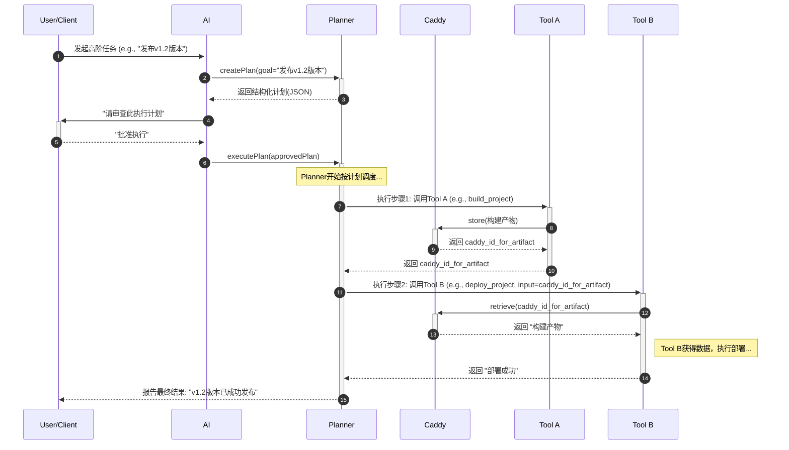

# Planner + Caddy 架构方案

本文档详细阐述了基于 "Planner" (计划执行器) 和 "Caddy" (状态暂存器) 的AI工作流架构方案。

## 整体逻辑

这个架构的核心思想是**"计划与执行分离" (Planning vs. Execution)**。

1. **AI 负责"计划"**: 我们利用 LLM 强大的自然语言理解和推理能力，将用户的模糊指令转换成一个**确定性的、结构化的、可审查的**行动计划。AI的角色从一个不稳定的"执行者"转变为一个聪明的"参谋"。
2. **人类负责"审查"**: 在任何破坏性或关键操作执行之前，人类必须审查并批准由AI生成的计划。这是一个关键的"断路器"，确保系统的安全性和可控性。
3. **确定性代码负责"执行"**: 一旦计划被批准，执行工作就完全交给一个"白盒"的、逻辑固定的 `planner` 工具。它像一个严格的工头，按照图纸（计划）施工，不再有任何即兴发挥，保证了过程的可靠性。
4. **`caddy` 负责"状态传递"**: 在执行过程中，各个工具之间需要传递数据。`caddy` 作为一个可靠的"状态暂存器"，确保数据在传递过程中不会被AI污染，也避免了AI上下文的膨胀。

---

## 时序图 (Sequence Diagram)

## 流程步骤分解

参照上面的时序图，我们可以将整个过程分解为以下几个关键步骤：

1. **任务发起 (步骤 1)**: 用户向AI提出一个高阶、模糊的目标，例如"把项目发布到生产环境"。
2. **计划生成 (步骤 2-3)**:
    * AI调用 `planner.createPlan()`，请求将高阶目标转化为具体计划。
    * `planner` (或其背后的AI能力) 会生成一个结构化的JSON或YAML文件。这个文件是**行动蓝图**，它会定义：
        * 需要调用的工具序列 (e.g., `git_checkout`, `run_tests`, `build_app`, `deploy_to_server`)。
        * 每个工具调用的具体参数。
        * 工具之间的数据依赖关系，例如，`deploy_to_server` 的输入是 `build_app` 的输出。
3. **人工审查与批准 (步骤 4-5)**:
    * AI将这份清晰的、人类可读的计划呈现给用户。
    * 用户审查该计划，确认操作是安全的、符合预期的。这是防止AI产生"幻觉"或执行危险操作的关键**安全门**。
    * 用户输入"确认"或"批准"。
4. **计划执行 (步骤 6)**:
    * 得到批准后，AI调用 `planner.executePlan()`，并将被批准的计划作为参数传入。
    * 从此刻起，**AI的任务已经完成**，`planner` 接管一切。`planner` 是一个确定性的执行引擎，它会严格按照计划逐条执行。
5. **工具调用与状态传递 (步骤 7-14)**:
    * **(7)** `planner` 调用计划中的第一个工具 `Tool A` (例如 `build_project`)。
    * **(8-10)** `Tool A` 完成后，将其输出（例如构建产物）交给 `caddy` 存储，并从 `caddy` 获取一个唯一的数据指针 `caddy_id`。`Tool A` 将这个 `caddy_id` 作为其执行结果返回给 `planner`。
    * **(11)** `planner` 根据计划，调用需要该数据的下一个工具 `Tool B` (例如 `deploy_project`)，并将 `caddy_id`作为参数传给它。
    * **(12-13)** `Tool B` 在执行前，先用收到的 `caddy_id` 去 `caddy` 中取回它所需要的真实数据。
    * **(14)** `Tool B` 完成自己的任务，并将结果返回给 `planner`。
6. **结果报告 (步骤 15)**: `planner` 在完成所有计划步骤后，将最终的执行结果报告给用户。

---

## 架构核心思辨与问答 (Q&A)

本章节记录了在方案设计过程中，针对核心问题进行的深度探讨与澄清。

### Q1: 这个方案是否削弱了AI模型的价值，使其沦为简单的参数传递工具？

恰恰相反，此方案**非但没有削弱AI的核心价值，反而是将其价值最大化**，同时规避了其固有弱点。

AI的价值从"不可靠的执行者"升维至"不可或缺的智能规划师"。

> **<重要标记>**
> AI完成的是整个流程中最困难、最有价值的"翻译"工作：将用户模糊的、自然语言的**高级意图 (High-level Intent)**，结合当前项目的上下文，**翻译**成一份确定性的、结构化的、机器可读的**行动计划 (The Plan)**。
>
> 这个从 "Intent" 到 "Plan" 的过程，是真正的智能所在，是任何写死的程序都无法完成的。我们用它来做它最擅长的**"认知与规划"**。

### Q2: 为什么我们断定AI在"动手环节"会出错？

这个判断并非主观臆断，而是基于大语言模型（LLM）的**内在技术局限性**。

*   **核心本质**：AI是**概率性的 (Probabilistic)**，而可靠的系统执行需要**确定性 (Deterministic)**。依赖一个概率模型去执行需要100%精确的命令，本身就是一种架构风险。
*   **具体表现**：这种本质区别会导致现实中各种具体的失败模式：
    *   **命令"幻觉"**：创造不存在的参数。
    *   **上下文"遗忘"**：在长流程中丢失关键约束（如`--dry-run`）。
    *   **错误处理的"不确定性"**：面对错误时，可能做出危险的选择（如`--force`）。
    *   **对工具输出的"误读"**：无法像程序一样通过退出码（Exit Code）精确判断成功或失败。

> **<重要标记>**
> 我们设计的架构，本质上是一种**风险隔离**策略。让AI发挥其长处（规划），并将其弱点（执行的不可靠性）完全剥离，交给一个简单的、确定性的程序来处理。

### Q3: 这套方案和在AI IDE中设置 `auto_run=false` 有什么区别？

这是"范式转变"与"安全特性"的根本区别。`auto_run=false` 是在给一个**不可预测的过程**踩刹车；而我们的架构，是创造一个**完全可预测的执行过程**。

> **<重要标记>**
> 核心区别在于审批的对象完全不同：
> *   **`auto_run=false`**：你审批的是一个**孤立的、即时的"下一步"操作**。你批准了第一步，但完全不知道AI在第二步会提出什么。上下文可能随时"漂移"。
> *   **本方案**：你审批的是一份**完整的、包含所有步骤、上下文被"冻结"的"行动蓝图"**。在执行开始前，从第一步到最后一步的所有操作都已白纸黑字地定义好，具有100%的可预测性与可复现性。

### Q4: 所以，新方案的本质是把AI模型的"thinking"过程暴露并固化出来？

这个提炼非常准确，一针见血。它是一个三部曲：

1.  **暴露思考 (Expose the Thinking)**：我们不仅是"偷窥"AI的想法。
2.  **"固化"思考为"计划" (Formalize Thinking into a Plan)**：我们**强制**AI将它的思考过程，输出为一个结构化的、机器可读的**"行动蓝图"**。
3.  **"执行"计划而非"跟随"思考 (Execute the Plan, not the Thinking)**：我们把这份固化的、被批准的蓝图，交给一个没有自己"想法"的、确定性的执行器来完成。

> **<重要标记>**
> 我们的方案实现了从"听取一个聪明人的建议"到"**让他立下军令状，然后由最忠诚的士兵去执行**"的升级。这彻底解决了AI"想法多变，执行不靠谱"的根本问题。
